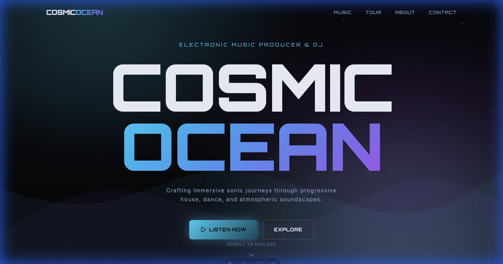

# 🌌 Cosmic Ocean | Electronic Music Artist Portfolio

Welcome to the **Cosmic Ocean** official web application. This project is a premium, high-performance landing page designed for an electronic music artist/DJ, featuring an immersive cosmic aesthetic, smooth animations, and a responsive experience.



## 🚀 Features

- **Immersive Visuals**: High-fidelity cosmic nebula background and a dynamic 3D starfield with parallax effects.
- **Interactive UI**: Built with React Islands in Astro for peak performance (hydration only where needed).
- **Music Showcase**: Dedicated section for featured releases and full discography.
- **Tour & Events**: Real-time event listing with ticket booking call-to-actions.
- **Responsive Design**: Tailored for all devices, from smartphone to 4K desktops (including MacBook 13" optimization).
- **Dark Mode Aesthetics**: Deep space-inspired color palette with bioluminescent accents.

## 🛠️ Tech Stack

- **Framework**: [Astro 5](https://astro.build/) (Static Site Generator + Islands Architecture)
- **UI Logic**: [React](https://reactjs.org/)
- **Styling**: [Tailwind CSS](https://tailwindcss.com/)
- **Animations**: [Framer Motion](https://www.framer.com/motion/) & CSS Custom Animations
- **Icons**: [Lucide React](https://lucide.dev/)

## 📦 Getting Started

To run this project locally, follow these steps:

1. **Clone the repository:**
   ```bash
   git clone https://github.com/PabloGarciaFuentes/cosmic-ocean.git
   cd cosmic-ocean
   ```

2. **Install dependencies:**
   ```bash
   npm install
   ```

3. **Start the development server:**
   ```bash
   npm run dev
   ```

4. **Open your browser:**
   Navigate to `http://localhost:4321`

## 🎨 Design System

The project uses a custom-built design system defined in `src/styles/global.css`:

- **Typography**: 'Orbitron' (Display) & 'Inter' (Body)
- **Colors**: Deep Navy, Glow Cyan, Nebula Violet
- **Animations**: Organic nebula flows and twinkling starfields.

## 📄 License

This project is licensed under the MIT License - see the [LICENSE](LICENSE) file for details.

---
*Created with ❤️ for Cosmic Ocean.*
